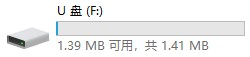
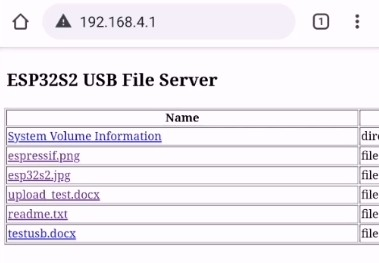

# USB Flash Disk File Serving Demo 20.10.19

USB Flash Disk with HTTP file server example demonstrates file serving with both upload and download capability.

**The demo is only used for function preview , only tested on Windows 10 now, don't be surprised if you find bug **

## Hardware

- Board：ESP32-S2-Saola-1_v1.2
- MCU：ESP32-S2 
- Flash：4MB NOR Flash
- Hardware Connection： 

GPIO19/20 to D-/D+ respectively for an ESP32-S2 board

## Functions

1.  USB MSC supported, you can read-write onboard flash from host;
2.  Download-upload data through WLAN, ESP32-S2 can act as a Wi-Fi AP or STA;
3.  USB CDC supported for communication with host over USB .

### Build The Example

1. for general uart download
   1. input `idf.py build` to build the example
   2. enter or autoswitch to downloader mode
   3. input `idf.py flash` to download the bin to esp32s2
2. only have usb port?
   1. input `idf.py dfu` to build the example
   2. pulldown `boot` io to enter `USB DFU` downloader mode
   3. input `idf.py dfu-flash` to download the bin to esp32s2

## How to Use

1. Plug-in with a micro USB cable to host USB port directly;
2. You can find a `1.5MB` disk in your `files resource manager`;
3. Connect with ESP32S2 through Wi-Fi, SSID:`ESP32S2_XXXXXX` with no password by default;
4. Input `192.168.4.1` in your browser,  you can find a file list of the disk;
5. Everything you drag to the disk will be displayed in web page (file size must < 200KB in this demo);
   
6. Everything you upload from web page will be displayed in the disk too (file size must < 200KB in this demo).
   

## Known Issues

1. Files uploaded through web can not be aware by host , so Windows  `files resource manager` can not update the files list automatically. Please remount the disk to update the files list (弹出重新加载) . This bug will be fixed later.
2. Files added or removed through USB disk, sometimes can not be found by web refresh, this bug will be fixed soon.
3. Speed limitation and capacity limitation, because of the NOR flash we use in this demo;

## Functions Under Development

1. Bug fix;
2. Support SD card ;
3. Support USB host to read from external disk ;
4. Support USB host to control external device.

## ESP32S2 USB Overview

### ESP32-S2 USB Hardware Description :

[ESP32-S2 family](https://www.espressif.com/sites/default/files/documentation/esp32-s2_datasheet_en.pdf) features a full-speed USB OTG interface which is compliant with the USB 1.1 specification. It has the following features:

* software-configurable endpoint settings and suspend/resume
* support for dynamic FIFO sizing
* support for session request protocol (SRP) and host negotiation protocol (HNP)
* a full-speed USB PHY integrated in the chip

### ESP32-S2 USB Software Description :

[TinyUSB](https://github.com/hathach/tinyusb) is integrating with [ESP-IDF](https://github.com/espressif/esp-idf) to provide USB features of the framework. TinyUSB is an open-source cross-platform USB Host/Device stack for embedded system, designed to be memory-safe with no dynamic allocation and thread-safe with all interrupt events are deferred then handled in the non-ISR task function.

#### Device Stack(Supported)

Supports multiple device configurations by dynamically changing usb descriptors. Low power functions such like suspend, resume, and remote wakeup. Following device classes are supported:

- Communication Class (CDC)
- Human Interface Device (HID): Generic (In & Out), Keyboard, Mouse, Gamepad etc ...
- Mass Storage Class (MSC): with multiple LUNs
- Musical Instrument Digital Interface (MIDI)
- Network with RNDIS, CDC-ECM (work in progress)
- USB Test and Measurement Class (USBTMC)
- Vendor-specific class support with generic In & Out endpoints. Can be used with MS OS 2.0 compatible descriptor to load winUSB driver without INF file.
- [WebUSB](https://github.com/WICG/webusb) with vendor-specific class

#### Host Stack([will support soon](https://esp32.com/viewtopic.php?f=10&t=14532))

**Most active development is on the Device stack. The Host stack is under rework**

- Human Interface Device (HID): Keyboard, Mouse, Generic
- Mass Storage Class (MSC)
- Hub currently only supports 1 level of hub (due to my laziness)
