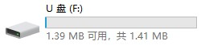
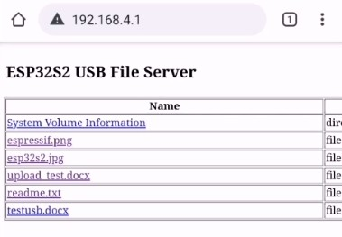

## U Disk file serving demo

HTTP file server with USB MSC example demonstrates file serving with both upload and download capability, using the `esp_http_server` component of ESP-IDF. 

### Build The Example

1. for general uart download
   1. input `idf.py build` to build the example
   2. enter or autoswitch to downloader mode
   3. input `idf.py flash` to download the bin to esp32s2
2. only have usb port?
   1. input `idf.py dfu` to build the example
   2. pulldown `boot` io to enter `USB DFU` downloader mode
   3. input `idf.py dfu-flash` to download the bin to esp32s2

### How To Use

```
GPIO20->USB+ , GPIO19->USB-
```
1. plug in to PC usb port directly, you can find a `1.5MB` disk in your files resource manager
2. connect to esp32s2 Wi-Fi ssid:`ESP32S2_XXXXXX`, input `192.168.4.1` in your brower, you can find a file list of the disk
3. everything you drag to the disk will be displayed in web page
4. everything you upload from web page will be displayed in the disk too




